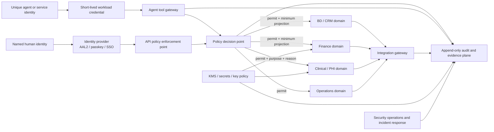

# Avalon Security Platform Architecture

Status: proposed target architecture and current-state audit
Audit date: 2026-08-30
Audited source: `02f4d899fe3b38ffa41326101c11e455c53658ae`
Decision owner: Avalon executive owner
Required reviewers before production implementation: security lead, privacy counsel, clinical operations owner, and system owner

## Decision

Security is an operating architecture for Avalon OS, not a feature flag and not a claim of compliance.

Avalon will use a zero-trust, least-privilege, default-deny design with explicit data classification, separated authorization domains, bounded agent identities, human approval for consequential actions, durable audit evidence, and fail-secure release gates.

This document is not a HIPAA, HITECH, ISO, GDPR, PCI DSS, or other legal certification. Software controls are only part of a defensible program. Contracts, BAAs/DPAs, risk analysis, workforce policy and training, incident operations, physical safeguards, vendor oversight, and independent review remain necessary.

## Audit verdict

The candidate contains meaningful foundations: server-side access-token verification, role and tenant reload from the profile, inactive-user rejection, RLS contract tests, immutable database audit rows, private receipt quarantine, safe error helpers, environment isolation tests, a disabled RobBot3K sending adapter, exact-payload outreach approvals, CI secret scanning, HSTS, and other browser headers.

Those controls do not offset the current release blockers:

| Priority | Finding | Security consequence | Source evidence |
| --- | --- | --- | --- |
| P0 | Baseline: `staff` is included in `is_operator()`, the broad profiles policy trusts any operator, and the authority trigger exempts operators. Review candidate: migration 055 removes that path but is not applied. | A signed-in staff member can use the baseline Data API to modify authority fields or another tenant's profile | `supabase/migrations/003_healthcare_os_core.sql:897-906`; `supabase/migrations/012_admin_team_management.sql:31-57`; `supabase/migrations/041_profiles_authority_guard.sql:15-18`; `supabase/migrations/055_profiles_authority_rls_hardening.sql` |
| P0 | Baseline: several service-role APIs authorize the route but do not tenant-scope the object. Review candidate: the identified communications/event paths are scoped, but live two-tenant evidence and a complete inventory remain open. | Cross-tenant communications or event records can be read or changed through a leaked or guessed identifier | `api/admin/communications/thread.js`; `api/events/manifest.js`; `api/events/serve.js`; `scripts/verify-service-role-tenant-boundaries.mjs` |
| P0 | The Qualiphy callback lacks a signed body, freshness check, and replay store. Review candidate blocks the legacy path in production but does not replace it. | A leaked legacy secret can forge or replay synthetic/non-production clinical state; production integration remains unavailable | `api/webhooks/qualiphy-inbound.js`; `scripts/p0-data-containment-qa.mjs` |
| P0 | Baseline member-message attachments are public. Review candidate migration 056 makes them private and the UI disables access, but the migration is not applied and existing objects are not inventoried. | Anyone holding a baseline stored object URL may retrieve a member image until storage rollout and exposure review | `supabase/migrations/026_member_message_attachments.sql:7-41`; `supabase/migrations/056_secure_member_message_attachments.sql`; `app-modules/pages/members/Messages.jsx` |
| P0 | Baseline Clinical profile/intake fields can enter browser storage. Review candidate removes the identified live profile and BookNow persistence paths; staging browser/device evidence and a complete storage inventory remain open. | RESTRICTED data can remain on a shared or compromised device and escape server policy | `app-modules/pages/BookNow.jsx`; `app-modules/pages/members/Account.jsx`; `app-modules/lib/platformOps.js`; `src/lib/localOs.js`; `src/lib/useAuthStore.js` |
| P0 | Baseline communications use nullable tenant IDs and global `(channel, contact)` uniqueness. Review migration 057 and matching handlers fail closed, but legacy rows are not inventoried/backfilled and constraints are not applied/validated. | Contacts can collide across tenants and messages can join the wrong conversation until staged reconciliation and rollout | `supabase/migrations/012_comm_threads.sql:11-49`; `supabase/migrations/057_communications_tenant_integrity.sql`; `api/_lib/comm-store.js` |
| P0 | Privileged MFA remains off until paired client/server flags are activated and production enrollment/recovery evidence is captured. Review code centralizes Admin/staff MFA and forced-rotation checks across standard and identified custom API gates, but direct Supabase RLS operator policies do not yet require JWT `aal2`. | A stolen AAL1 operator token can still bypass the React/API gate through permitted Data API policies until database authorization also enforces step-up. | `api/_lib/supabase-auth.js`; `api/_lib/os-api.js`; `api/events/organizer.js`; `api/events/assets.js`; `api/events/documents.js`; `api/appointment-summary.js`; `src/lib/mfaAssurance.js`; `supabase/migrations/003_healthcare_os_core.sql:897-1059`; `docs/AUTH_SETUP.md` |
| P0 | Required healthcare vendor agreements and configuration evidence are incomplete | Real PHI cannot be released on the strength of code controls alone | `docs/PHI_DATA_FLOW.md:5-18`; `docs/GO_LIVE_STATUS.md:18-28` |
| P0 | Baseline launch-blocker rejected `app-modules/pages/NurseInvoice.jsx`; the review candidate corrects the copy and the built suite passes | The exact hosted artifact still needs protected CI and release verification | `app-modules/pages/NurseInvoice.jsx`; `scripts/launch-blocker-qa.mjs` |

Until the P0 controls are verified, production posture is:

- no real PHI in routes or vendors that lack completed contractual and technical gates;
- no autonomous clinical outreach;
- no RobBot3K live sends, form submissions, calendar mutations, or production CRM mutations;
- RobBot3K may research, enrich, score, and draft for human review only;
- no security or compliance certification claim.

## Evidence boundary

This audit reviewed repository source, migrations, tests, and written operating contracts. It did not independently verify:

- which migrations are applied in each Supabase project;
- production environment values or secret rotation;
- Supabase, Vercel, GitHub, Stripe, Acuity, Cognito Forms, or other provider dashboard settings;
- signed BAAs, DPAs, subprocessors, or legal bases;
- production backups, point-in-time recovery, restore results, RPO, or RTO;
- live network/TLS configuration, device posture, or incident readiness;
- actual production data, access history, or exploitation.

Every runtime or contractual control stays `UNVERIFIED` until evidence is attached in `SECURITY_CONTROL_REGISTRY.md`.

### Current review-candidate verification results

| Check | Result on 2026-08-30 | Meaning |
| --- | --- | --- |
| `npm run build` | PASS | The audited candidate produces a production bundle after installing the locked dependency tree. |
| `npm run test:security` | PASS | Existing pre-API live-vendor and PHI storage guards match their code contract. This is not a complete security test. |
| `npm run test:privacy` | PASS | The current privacy QA recognizes 11 browser storage key patterns. It does not neutralize the separately identified clinical browser-persistence path. |
| `npm run test:os-rls` | PASS | The current contract suite passes 17 covered tables. The profiles escalation and service-role API paths show that the suite is not complete. |
| `npm run test:os-env` | PASS | The isolated beta contract refuses production credentials, projects, targets, and demo auth. |
| `npm audit --omit=dev --audit-level=high` | PASS at the configured threshold | No high/critical production advisory was reported; two moderate React Router advisories remain for planned, tested upgrade work. |
| `npm run test:launch-blockers` | PASS | The built review candidate clears the current launch-blocker contracts. This is not hosted or production evidence. |

Passing a focused contract test proves only that contract. The findings in this audit become new negative tests before their controls can be considered verified.

## Target architecture

Avalon does not need a graph database to establish security. It needs a policy graph: identities, resources, purposes, approvals, and evidence must be connected by explicit, testable authorization decisions. The source-of-truth data can remain relational.

### Trust zones

1. **Public edge** — marketing, catalog, public forms, static content, WAF/rate controls. It has no implicit path to PHI.
2. **Identity and policy plane** — identity provider, MFA/passkeys, session service, policy decision point, approval service, and entitlement registry.
3. **Admin control plane** — named operators, action-specific screens, step-up authentication, and domain-separated APIs.
4. **Clinical domain** — patient identity, care operations, consent/authorization, clinical communications, and PHI. Acuity remains the chart and scheduling source of record until a separately approved change.
5. **BD domain** — companies, business people, opportunities, activities, public research, outreach approvals, suppressions, replies, and meetings. It cannot query Clinical.
6. **Finance domain** — invoices, receipts, payout references, reconciliation, and minimum identity linkage. It does not expose clinical payloads.
7. **Agent execution plane** — isolated jobs with unique workload identity, policy-bound tools, budgets, kill switches, and no direct service-role database credential.
8. **Integration gateway** — provider-specific adapters, egress classification checks, signatures, replay controls, idempotency, reconciliation, and vendor policy.
9. **Audit and security evidence plane** — append-only security events, control evidence, alerts, access reviews, and incident cases. Product operators cannot rewrite it.
10. **Data protection plane** — KMS, secret manager, tokenization, backup encryption, key rotation, and cryptographic inventory.

No zone is trusted merely because it is inside Avalon infrastructure. Each crossing requires authenticated identity, resource authorization, purpose, classification, tenant, and risk evaluation.

## Data classification

Every table, field, file type, queue payload, log schema, analytics event, integration property, agent memory object, and backup set must declare one of these classifications.

| Class | Examples | Default controls |
| --- | --- | --- |
| PUBLIC | Published catalog data, approved marketing pages, intentionally public event assets | Integrity controls, safe publishing workflow, no inherited public status for related private objects |
| INTERNAL | Non-public runbooks, deployment metadata, non-identifying operational metrics | Named workforce access, encryption in transit/at rest, retention owner, no public links |
| CONFIDENTIAL | BD records, contracts, provider/workforce status, invoices and payout data, non-public financial and customer operations | Domain role, tenant scope, short-lived access, audit for mutation/export, private storage, vendor allowlist |
| RESTRICTED | PHI/ePHI, patient/member communications, clinical intake, GFE data, government or bank identifiers, authentication secrets, keys, security credentials | Purpose and minimum-necessary projection, step-up for privileged actions, sensitive-read audit, field or envelope encryption where risk warrants, no browser persistence, no general-purpose agent access, strict egress policy, shortest justified retention |

Unknown classification is treated as RESTRICTED until an owner classifies it.

### Data asset registry

Each asset record must include:

- data owner and security steward;
- system of record and authoritative identifier;
- classification and sensitive fields;
- permitted purposes and user/agent audiences;
- tenant and jurisdiction;
- retention, deletion, legal hold, and backup treatment;
- encryption/key identifier and rotation policy;
- approved vendors, subprocessors, regions, and contracts;
- ingress, egress, analytics, search, log, and agent-memory behavior;
- recovery tier, RPO, RTO, and last restore evidence.

## Domain separation and minimum projections

| Domain | System of record | Permitted identities | Prohibited coupling |
| --- | --- | --- | --- |
| Identity | Supabase Auth plus authoritative profile/entitlement store | identity service, security administrators through narrow actions | no role authority from client claims or browser state |
| Clinical | Acuity for chart/scheduling; approved Clinical CRM for communication authority and relationships | assigned care team, approved clinical operators, privacy/security reviewers for defined cases | no PHI in BD notes, general analytics, general agent prompts, support tools, or unapproved vendors |
| BD | Avalon BD | BD operators and RobBot3K with CONFIDENTIAL ceiling | no patient identity, visit history, diagnosis, medication, GFE, or clinical selection criteria |
| Finance | Avalon Finance plus payment provider references | Finance roles; minimum identity view for reconciliation | no clinical payload, no raw payment card data, no broad `staff` grant |
| HR/workforce | approved workforce system | HR and credentialing roles | no general Admin or BD access |
| Audit/security | append-only evidence store and SIEM | security, privacy, auditor roles; product services append through controlled interface | no product operator update/delete; no raw secrets or unnecessary PHI payloads |
| Analytics | allowlisted, schema-validated events | analytics service and approved analysts | disabled on Clinical surfaces by default; no free-form PHI/PII properties |
| Agent memory | task-scoped encrypted records | originating agent and explicitly delegated humans/services | no cross-agent global memory; no Clinical data for general business agents |

The policy engine must return a minimum projection, not merely `allow=true`. A Finance summary may receive invoice totals and a payout identity; it must not receive an appointment's clinical JSON because both happen to share a row today.

## Identity, session, and authorization architecture

### Human identity

- One named account per person. Shared admin credentials are forbidden.
- Passkeys or SSO are preferred; AAL2 is mandatory for all privileged production roles.
- Fresh step-up is required for authority changes, bulk exports, key/secret actions, payouts, sensitive Clinical access, and agent-policy changes.
- Sessions have server-enforced idle and absolute lifetimes, risk-aware renewal, device/session inventory, remote revoke, and global revocation after password/MFA/role changes.
- Break-glass accounts are few, hardware-protected, monitored, time-bounded, and reviewed after every use.
- Production access is joined to workforce status and removed promptly on termination or role change.

### Authorization

Authorization uses RBAC plus ABAC:

`permit = role/action entitlement AND tenant AND resource relationship AND purpose AND classification ceiling AND jurisdiction AND session assurance AND current risk state`

Required action permissions include, at minimum:

- `clinical.patient.read_identity`, `clinical.communication.approve`, `clinical.record.read_sensitive`;
- `finance.invoice.review`, `finance.payment.record`, `finance.export`;
- `bd.prospect.research`, `bd.outreach.approve`, `bd.outreach.send`;
- `identity.member.invite`, `identity.authority.change`;
- `security.audit.read`, `security.policy.change`, `security.break_glass`.

Tenant administrator and Avalon super-administrator are separate identities and policy paths. Cross-tenant access is exceptional, reason-bound, step-up protected, and audited.

### Enforcement pattern

- Browser route guards improve UX only; they never grant authority.
- Every API is a policy enforcement point and validates the authenticated principal, tenant, action, resource, purpose, and request schema.
- Every service-role query includes tenant and object scope, even when RLS exists.
- Database RLS and narrow RPCs provide a second boundary.
- Service-role keys are not general application identities. Replace broad use with scoped database roles or narrowly exposed server functions.
- All denials that target sensitive resources generate security evidence without disclosing the protected object.

## Agent and automation security

Every agent, scheduler, worker, and integration is a workload identity with:

- a unique `service_principal_id` and owner;
- short-lived credential issued for a specific environment and task;
- tenant and data-classification ceiling;
- explicit tool/action/resource allowlist;
- model/provider allowlist and approved data categories;
- time, rate, spend, recipient, and result limits;
- an approval policy and exact approved-payload hash where required;
- an immutable execution record and correlation ID;
- a global and per-agent kill switch;
- idempotency, retry, dead-letter, replay, reconciliation, and recovery rules.

Agents never receive a reusable database service-role key and never decide their own permissions. The tool gateway obtains an external policy decision for every consequential call.

RobBot3K has a CONFIDENTIAL BD ceiling. It may autonomously research public sources, enrich, rank, and draft. A human must approve the exact recipient, sender, subject, rendered body, attachments, follow-up schedule, and calendar behavior. Any payload change invalidates approval. Replies, unsubscribes, complaints, hard bounces, meetings, manual pause, or a kill switch stop follow-ups immediately. RobBot3K has no Clinical tool.

Clinical agents, if later approved, receive a separate identity, separate tool set, minimum-necessary retrieval, purpose-bound authorization, approved model/provider path, and clinical human supervision. A general business agent can never inherit that access.

## Encryption, keys, and secrets

- Require current TLS for browser, mobile, service, database, webhook, provider, and tool-gateway traffic.
- Verify managed-database, object-storage, queue, log, snapshot, and backup encryption with provider evidence.
- Use a managed KMS and envelope encryption for designated RESTRICTED fields and high-value secrets; do not invent cryptography.
- Separate production, staging, and development keys, accounts, projects, and policies.
- Maintain a key inventory with purpose, owner, algorithm, environment, dependent assets, creation, rotation, last use, and retirement.
- Secrets live in an approved secret manager, never in browser bundles, source, logs, issue trackers, prompts, or reusable test fixtures.
- Workloads retrieve secrets just in time using short-lived identity where the platform supports it.
- Rotation includes dual-key transition, dependency inventory, verification, revocation, and incident-triggered emergency procedure.
- Passwords are stored only by the identity provider using appropriate password hashing; reversible password encryption is prohibited.

## APIs, webhooks, integrations, and egress

All APIs require:

- explicit authentication or a documented public classification;
- server-side action/resource authorization;
- typed request and response schemas with size and complexity limits;
- persistent distributed rate limits, fail-closed on privileged/high-risk paths;
- object-level and property-level authorization;
- idempotency for retryable mutations;
- safe error responses and centrally redacted logs;
- consistent audit and correlation identifiers;
- same-origin validation for browser mutations where applicable.

Provider webhooks require a native signature or HMAC over the raw body, constant-time verification, timestamp freshness, durable event-ID replay rejection, provider-account-to-tenant binding, size limits, schema validation, idempotent processing, and reconciliation.

The vendor registry is a runtime policy input. Egress is denied unless the vendor, data category, purpose, region, contract/BAA/DPA, retention, and incident obligations are approved. An API being available is not permission to send it data.

## Files and object storage

Treat every upload as hostile:

1. Upload only into a private quarantine bucket with a random server-generated object name.
2. Validate declared size and type, magic bytes, parser safety, archive expansion, and file structure.
3. Scan for malware and, where applicable, DLP policy violations.
4. Produce a safe rendition when possible rather than serving the original.
5. Move to a cleared private location only after all gates pass.
6. Authorize every download and issue a very short-lived signed URL.
7. Audit upload, scan, clear, read, download, export, delete, and failure events.
8. Enforce lifecycle deletion, orphan cleanup, legal hold, backup treatment, and revocation.

Public buckets are permitted only for assets intentionally classified PUBLIC. A member, patient, invoice, Clinical, HR, Finance, or internal-message attachment can never use one.

## Audit, detection, and evidence

Sensitive reads, writes, denials, exports, searches, merges, approvals, authority changes, authentication events, integration calls, agent decisions, and agent tool actions produce audit records.

Each record includes:

- human or workload identity, delegated identity, tenant, role, session/device, and assurance level;
- action, resource, classification, permitted/denied outcome, policy and reason;
- purpose/access reason, approval identifier and hash when applicable;
- source network metadata and correlation/trace identifiers;
- before/after hashes or minimum non-sensitive change metadata;
- event time, ingestion time, integrity proof, retention class, and export status.

Audit writes for privileged and RESTRICTED operations are transactional or fail closed. The append path is isolated from product write authority. Evidence is exported to an immutable/WORM-capable destination and security monitoring. Raw secrets, tokens, message bodies, or unnecessary PHI never enter audit payloads.

Detection includes impossible travel/session anomalies, repeated authorization denials, unusual sensitive-record access, bulk search/export, role changes, disabled controls, key/secret events, agent budget/rate anomalies, webhook replay, and reconciliation drift.

## Secure delivery and environment separation

- Separate provider accounts/projects, data, credentials, keys, domains, and release permissions for development, staging, and production.
- No production PHI in ordinary development; use synthetic or formally de-identified fixtures.
- Protected branches require passing tests and independent review for security-sensitive paths.
- CI includes secret scanning, dependency review, vulnerability scanning, SAST, SBOM, license/policy checks, infrastructure/configuration scanning, migration/RLS negative tests, and application security tests.
- Production release uses a reviewed artifact, environment approval, provenance, rollback plan, and post-deploy verification. Developer workstations do not push directly to production.
- Findings have severity, owner, due date, remediation evidence, risk acceptance authority, and retest result.

## Resilience, recovery, and incident response

Every production data service declares RPO/RTO, backup scope, encryption/key dependency, retention, regional strategy, and recovery owner. Backups are immutable or isolated from ordinary production credentials. Restore exercises prove application consistency and are recorded at least at the interval set by policy.

Incident operations include classification, on-call escalation, containment, credential/key rotation, vendor coordination, evidence preservation, legal/privacy assessment, notification decision support, recovery, and post-incident improvement. Runbooks cover at least account takeover, PHI disclosure, malicious insider, ransomware/database theft, lost device, provider compromise, webhook forgery, agent misbehavior, secret exposure, and region outage.

## Security and Compliance Admin Center

The Admin Center is an evidence surface, not a green badge generator. It should show:

- control status: `NOT_IMPLEMENTED`, `IMPLEMENTED_UNVERIFIED`, `VERIFIED`, `EXCEPTION`, or `FAILED`;
- evidence source, collection time, environment, owner, reviewer, expiry, and next test;
- identity/session/device inventory and access reviews;
- agent identities, policies, approvals, budgets, kills, and execution history;
- vendor registry, data flows, BAA/DPA status, regions, and approved classifications;
- key/secret inventory and rotation evidence without revealing secret material;
- vulnerabilities, dependency/SBOM state, penetration-test findings, and exceptions;
- backup/restore, RPO/RTO, incident, and tabletop evidence;
- privacy requests, retention/deletion jobs, legal holds, and jurisdiction policy packs.

The UI must say `unverified` or `evidence missing` when the platform cannot prove a control. It must never infer compliance from the existence of code.

## Framework alignment

The control registry is organized so Avalon can map evidence to:

- the current HIPAA Security Rule administrative, physical, and technical safeguards;
- HITECH and applicable healthcare breach/security obligations;
- NIST Cybersecurity Framework 2.0 and NIST SP 800-53;
- NIST SP 800-207 zero-trust principles;
- ISO/IEC 27001 information-security management and ISO/IEC 27701 privacy-information management;
- GDPR privacy by design and security appropriate to risk, including resilience, recovery, and regular testing;
- OWASP ASVS and OWASP Top 10 application controls;
- PCI DSS scoping and segmentation where payment environments apply;
- jurisdiction-specific healthcare and privacy policy packs reviewed by counsel.

Framework mappings are traceability aids, not certifications. The HHS cybersecurity update described in the repository prompt is a proposed rule, not a final replacement for the current HIPAA Security Rule; Avalon should design above the current minimum without misrepresenting the law.

### Authoritative reference set

- [HHS HIPAA Security Rule overview](https://www.hhs.gov/hipaa/for-professionals/security/index.html)
- [HHS current Security Rule summary](https://www.hhs.gov/hipaa/for-professionals/security/laws-regulations/index.html)
- [HHS Security Rule NPRM](https://www.hhs.gov/hipaa/for-professionals/security/hipaa-security-rule-nprm/index.html)
- [NIST Cybersecurity Framework 2.0](https://www.nist.gov/cyberframework)
- [NIST SP 800-207 Zero Trust Architecture](https://csrc.nist.gov/pubs/sp/800/207/final)
- [NIST SP 800-53 Revision 5](https://csrc.nist.gov/pubs/sp/800/53/r5/upd1/final)
- [OWASP Application Security Verification Standard](https://owasp.org/www-project-application-security-verification-standard/)
- [ISO/IEC 27001](https://www.iso.org/standard/27001)
- [ISO/IEC 27701](https://www.iso.org/standard/27701)
- [GDPR consolidated text](https://eur-lex.europa.eu/legal-content/EN/TXT/PDF/?uri=CELEX:02016R0679-20160504)

## Acceptance standard

Avalon reaches the target posture only when:

- every sensitive flow is in the asset and vendor registries;
- every privileged action is attributable to one human or workload identity;
- every agent has bounded, externally enforced authority;
- every secret and key has an owner, policy, rotation, and evidence;
- every P0 has passed negative and end-to-end tests in staging;
- real-PHI vendors have required contracts and verified configuration;
- production restore and incident exercises have current evidence;
- independent reviewers can reproduce major control tests;
- exceptions are time-bounded, approved by the proper risk owner, and visible;
- counsel, security, and accountable operators approve the relevant launch scope.
